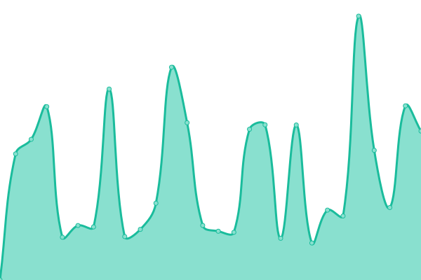
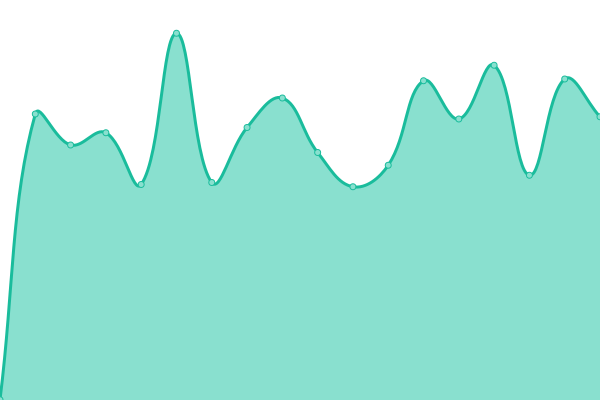

# [📈 Live Status](https://status.quantrum.gr): <!--live status--> **🟩 All systems operational**

This repository contains the open-source uptime monitor and status page for [Quantrum](https://www.quantrum.gr).

<!--start: status pages-->
<!-- This summary is generated by Upptime (https://github.com/upptime/upptime) -->
<!-- Do not edit this manually, your changes will be overwritten -->
<!-- prettier-ignore -->
| URL | Status | History | Response Time | Uptime |
| --- | ------ | ------- | ------------- | ------ |
|  [Quantrum Website](https://quantrum.gr) | 🟩 Up | [quantrum-website.yml](https://github.com/QuantrumDigital/uptime/commits/HEAD/history/quantrum-website.yml) | 

 1401ms
     
 | 

<a href="https://status.quantrum.gr/history/quantrum-website">99.30%</a>
    

|  Hosting Server 1 | 🟩 Up | [hosting-server-1.yml](https://github.com/QuantrumDigital/uptime/commits/HEAD/history/hosting-server-1.yml) | 

 883ms
     
 | 

<a href="https://status.quantrum.gr/history/hosting-server-1">99.61%</a>
    

<!--end: status pages-->

[**Visit our status website →**](https://status.quantrum.gr)

## 📄 License

- Powered by: [Upptime](https://github.com/upptime/upptime)
- Code: [MIT](./LICENSE) © [Quantrum](https://www.quantrum.gr)
- Data in the `./history` directory: [Open Database License](https://opendatacommons.org/licenses/odbl/1-0/)
